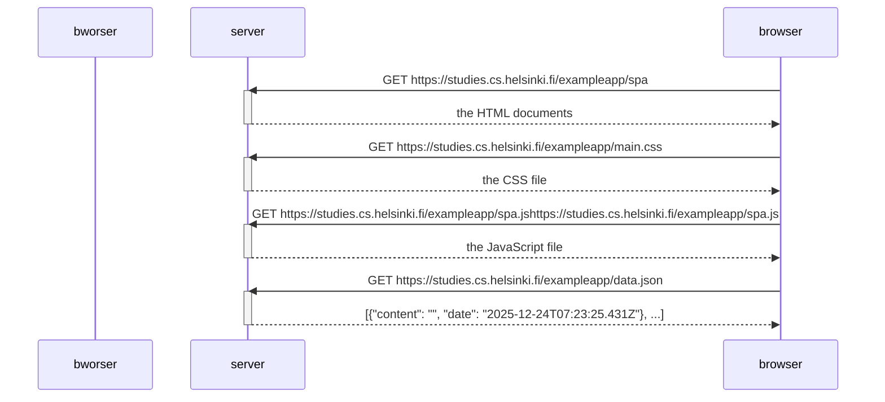

```mermaid
sequenceDiagram
	participant bworser
	participant server

	browser->>server: GET https://studies.cs.helsinki.fi/exampleapp/spa
	activate server
	server-->>browser: the HTML documents
	deactivate server

	browser->>server: GET https://studies.cs.helsinki.fi/exampleapp/main.css
	activate server
	server-->>browser: the CSS file
	deactivate server

	browser->>server: GET https://studies.cs.helsinki.fi/exampleapp/spa.jshttps://studies.cs.helsinki.fi/exampleapp/spa.js
	activate server
	server-->>browser: the JavaScript file
	deactivate server

	browser->>server: GET https://studies.cs.helsinki.fi/exampleapp/data.json
	activate server
	server-->>browser: [{"content": "", "date": "2025-12-24T07:23:25.431Z"}, ...]
	deactivate server
```
