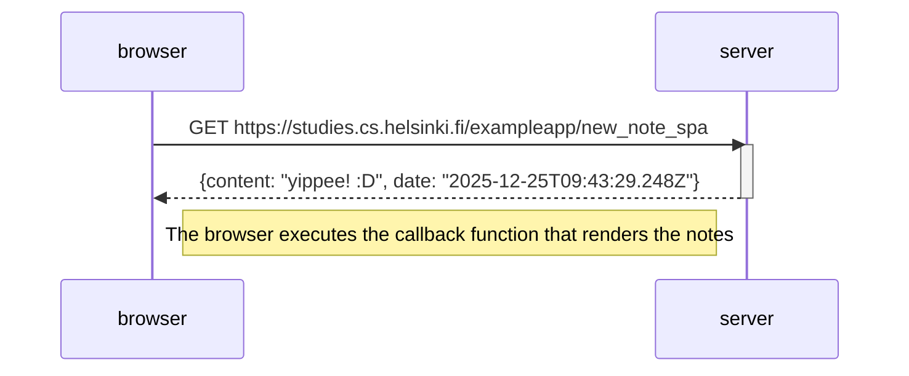

```mermaid
sequenceDiagram
	participant browser
	participant server
	browser->>server: GET https://studies.cs.helsinki.fi/exampleapp/new_note_spa
	activate server
	server-->>browser: {content: "yippee! :D", date: "2025-12-25T09:43:29.248Z"}
	deactivate server
	note right of browser: The browser executes the callback function that renders the notes
```
